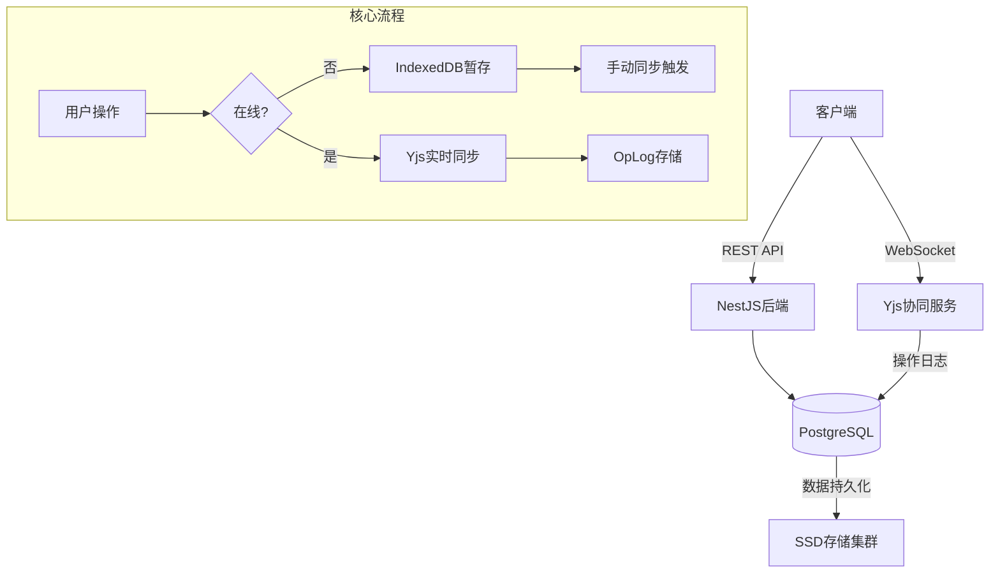
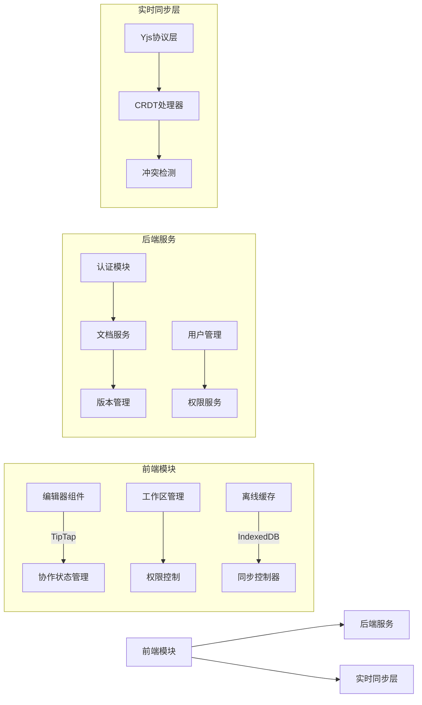
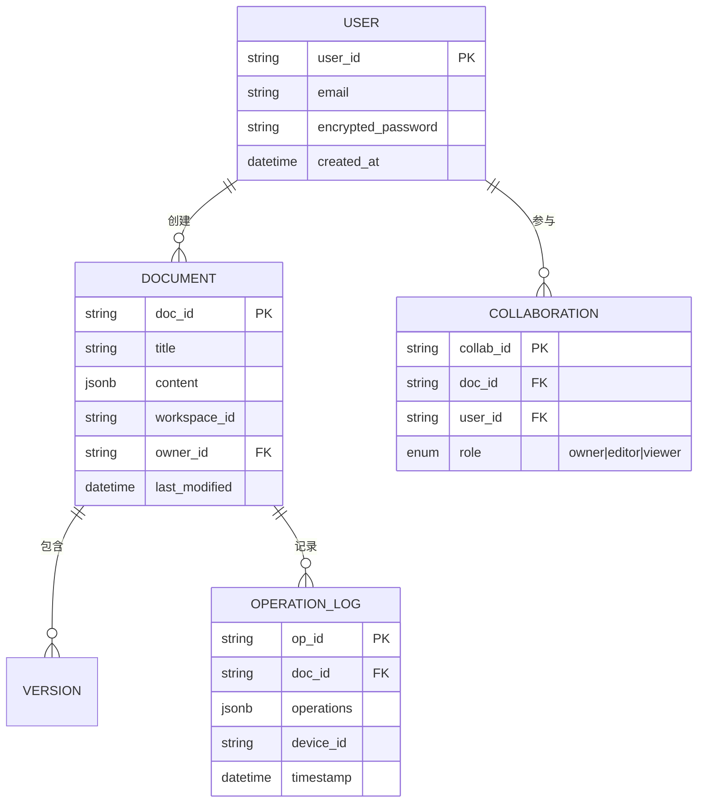
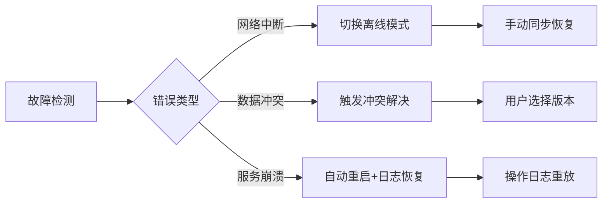

# Synote概要设计说明书

## **1. 引言**

### **1.1 编写目的**

本文档提供Synote多人协作富文本编辑器的概要设计方案，描述系统架构、模块划分、数据结构和接口设计，作为详细设计和开发的基础。目标读者包括开发团队、测试人员和项目管理者。

### **1.2 背景**

- **系统名称**：Synote多人协作富文本编辑器
- **任务提出者**：产品管理团队
- **开发者**：独立开发组
- **目标用户**：知识工作者、项目团队（支持100+并发编辑）
- **运行环境**：Web端（Vue.js前端 + NestJS后端 + PostgreSQL + Yjs）

### **1.3 定义**

| **术语** | **定义** |
| --- | --- |
| CRDT | 无冲突复制数据类型，保障实时协作数据一致性 |
| OpLog | 操作日志存储模型，支持版本回溯和冲突解决 |
| 一人协作单元 | 单人文档采用多人协作架构，支持秒级切换为多人协作 |
| Yjs | 实时数据同步框架，实现协同编辑核心功能 |

### **1.4 参考资料**

1. 《Synote软件需求说明书》(V2.0)
2. 《软件需求说明书规范》(GB/T 8567-2006)
3. NestJS框架技术文档
4. Yjs CRDT技术白皮书
5. PostgreSQL 14官方文档

---

## **2. 总体设计**

### **2.1 需求规定**

系统需满足以下核心需求：

- 所有文档默认启用实时协作架构（含单人文档）
- 支持富文本编辑（格式控制、多媒体嵌入、Markdown）
- 多工作区管理与权限分级（所有者/编辑者/查看者）
- 离线/在线混合保存机制（手动同步）
- 响应式布局（桌面三栏/移动端全屏）

### **2.2 运行环境**

### **硬件环境：**

- 服务器：8GB RAM + 4核CPU（基础）/16GB RAM+8核CPU（扩展）
- 客户端：支持现代浏览器的PC/移动设备

### **软件环境：**

| **组件** | **要求** |
| --- | --- |
| 前端 | Vue.js 3.x + TipTap富文本编辑器 |
| 后端 | NestJS + Node.js 16.x |
| 数据库 | PostgreSQL 14+（JSONB存储） |
| 实时同步 | Yjs 0.19.x + WebSocket |
| 浏览器 | Chrome 90+/Firefox 85+/Safari 15+ |

### **2.3 基本设计概念和处理流程**

### **2.4 系统结构**

### **2.5 功能需求与程序关系**

| **功能需求** | **前端模块** | **后端服务** | **实时同步层** |
| --- | --- | --- | --- |
| 实时协作基础 | 协作状态管理 | 文档服务 | Yjs协议层 |
| 富文本编辑 | 编辑器组件 | - | CRDT处理器 |
| 权限分级 | 权限控制 | 权限服务 | - |
| 离线同步 | 离线缓存/同步控制器 | 文档服务 | 冲突检测 |
| 版本历史 | - | 版本管理 | CRDT处理器 |

### **2.6 人工处理过程**

1. **冲突解决**：当检测到离线编辑冲突时，用户需在可视化界面手动选择保留版本
2. **数据恢复**：管理员可通过操作日志重建历史版本（`/history/{docId}` API）

### **2.7 尚未解决问题**

1. 大规模文档（10万+字符）的CRDT同步效率优化
2. 移动端Safari浏览器对IndexedDB的容量限制处理
3. 跨时区协作的时间戳同步机制

---

## **3. 接口设计**

### **3.1 用户接口**

- **命令接口**：
    - `/`：唤出插入菜单（模板/多媒体）
    - `@username`：提及协作者触发通知
    - `Ctrl+S`：手动触发同步（离线模式）
- **状态反馈**：
    - 🌐在线同步中（实时）
    - 📱仅我编辑（单人模式）
    - ⚠待同步操作数（离线编辑）

### **3.2 外部接口**

| **接口类型** | **协议** | **说明** |
| --- | --- | --- |
| 第三方登录 | OAuth 2.0 | Google/GitHub认证 |
| 视频嵌入 | iframe API | YouTube/B站视频嵌入 |
| 文件存储 | RESTful API | 图片/附件云存储 |

### **3.3 内部接口**

| **接口** | **协议** | **功能** |
| --- | --- | --- |
| 前端-后端 | RESTful | 文档管理/用户认证 |
| 编辑器-Yjs | WebSocket | 操作同步(300ms延迟) |
| 服务-数据库 | pg-promise | PostgreSQL数据存取 |
| 冲突解决 | JSON-RPC | 离线冲突数据对比 |

---

## **4. 运行设计**

### **4.1 运行模块组合**

| **运行场景** | **模块组合** | **支持软件** |
| --- | --- | --- |
| 在线协作 | 编辑器+Yjs协议层+文档服务 | WebSocket/PostgreSQL |
| 离线编辑 | 离线缓存+同步控制器 | IndexedDB/CRDT处理器 |
| 冲突解决 | 冲突检测+版本管理 | Diff算法/操作日志 |
| 权限变更 | 权限控制+权限服务 | JWT令牌/RBAC模型 |

### **4.2 运行控制**

1. **网络状态检测**：每5秒检查WebSocket连接状态
2. **模式切换**：
    - 在线→离线：自动启用IndexedDB缓存
    - 离线→在线：显示同步按钮（需手动触发）
3. **同步触发**：
    - 实时模式：操作后300ms内自动同步
    - 离线模式：用户点击同步按钮后批量提交

### **4.3 运行时间指标**

| **操作类型** | **最大耗时** | **触发条件** |
| --- | --- | --- |
| 文档加载 | ≤2秒 | 首次打开/刷新 |
| 协同操作 | <300ms | 内容编辑/格式变更 |
| 冲突解决 | ≤1秒 | 离线同步时检测冲突 |
| 状态切换 | ≤500ms | 单人↔多人协作切换 |

---

## **5. 系统数据结构设计**

### **5.1 逻辑结构设计**

### **核心数据实体：**

### **5.2 物理结构设计**

| **数据结构** | **存储要求** | **访问方式** |
| --- | --- | --- |
| 文档内容 | JSONB列 (PostgreSQL) | 按doc_id索引查询 |
| 操作日志 | 分片存储 (每月分表) | 时间范围查询 |
| 用户数据 | 加密存储 (AES-256) | 邮箱索引访问 |
| 离线缓存 | IndexedDB (浏览器) | LRU自动清理 |

### **5.3 数据结构与程序关系**

- **编辑器组件**：通过Yjs协议读写Operation Log
- **权限服务**：访问Collaboration表验证角色
- **版本管理**：基于Operation Log重建历史版本
- **同步控制器**：双向同步IndexedDB与Operation Log

---

## **6. 系统出错处理设计**

### **6.1 出错信息表**

| **错误代码** | **错误类型** | **提示信息** | **处理方式** |
| --- | --- | --- | --- |
| 4001 | 实时同步中断 | "网络不稳定，已切换离线模式" | 启用IndexedDB缓存 |
| 5002 | 权限冲突 | "您无此操作权限[需编辑者以上]" | 阻止操作并提示 |
| 3003 | 版本冲突 | "检测到编辑冲突，请选择保留版本" | 弹出冲突解决UI |
| 2004 | 存储超限 | "离线存储将满，请及时同步" | 清理旧缓存+警告 |

### **6.2 补救措施**

1. **后备技术**：
    - 每日数据库快照（保留7天）
    - 操作日志异地备份（AWS S3）
2. **降效运行**：
    - 高负载时关闭实时协同（仅保存本地）
    - 冲突过多时启用只读模式
3. **恢复机制**：

### **6.3 系统维护设计**

1. **监控体系**：
    - 实时协作状态仪表盘
    - 同步延迟>1s自动告警（Slack/Email）
2. **日志规范**：
    - 结构化日志格式：`[时间][用户][设备][操作]`
    - 关键操作审计：权限变更/文档删除
3. **维护接口**：
    - 文档历史重建：`GET /history/{docId}?timestamp=`
    - 系统状态检查：`GET /healthcheck`

---

*版本记录：V1.0 | 2023-11-10 | 概要设计初稿*