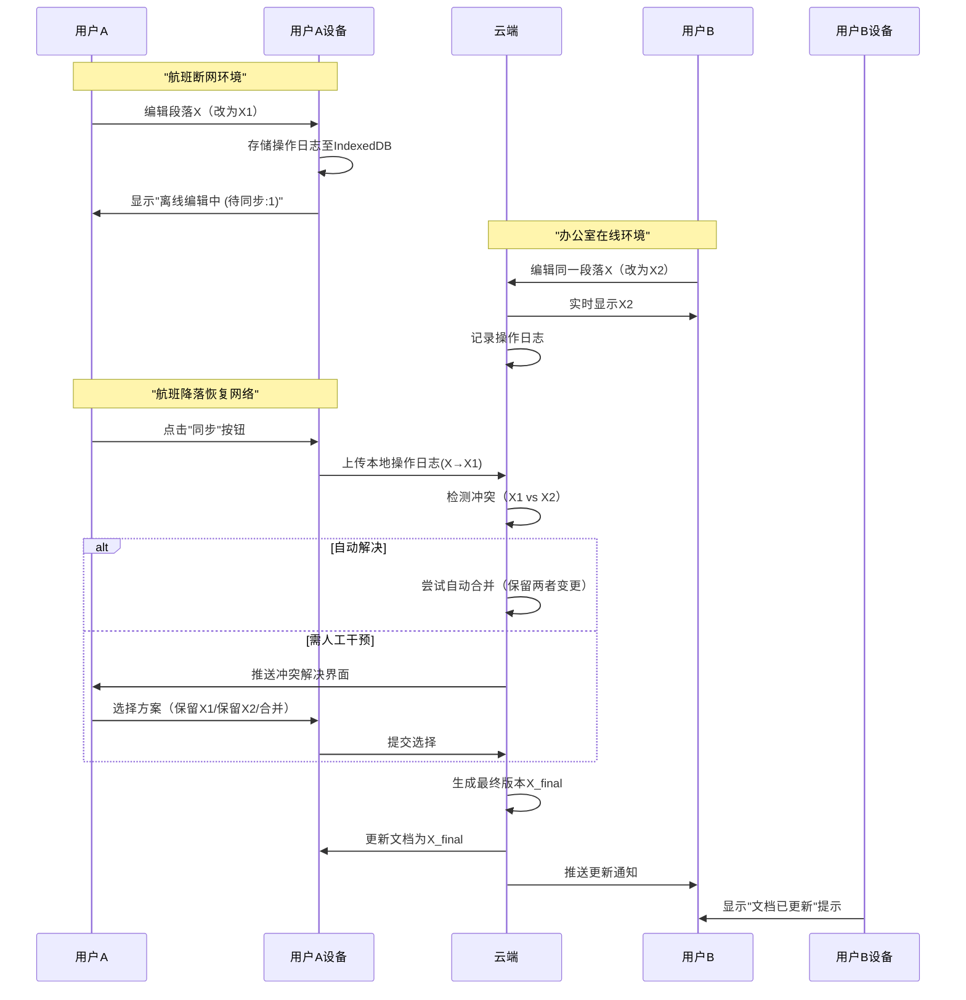
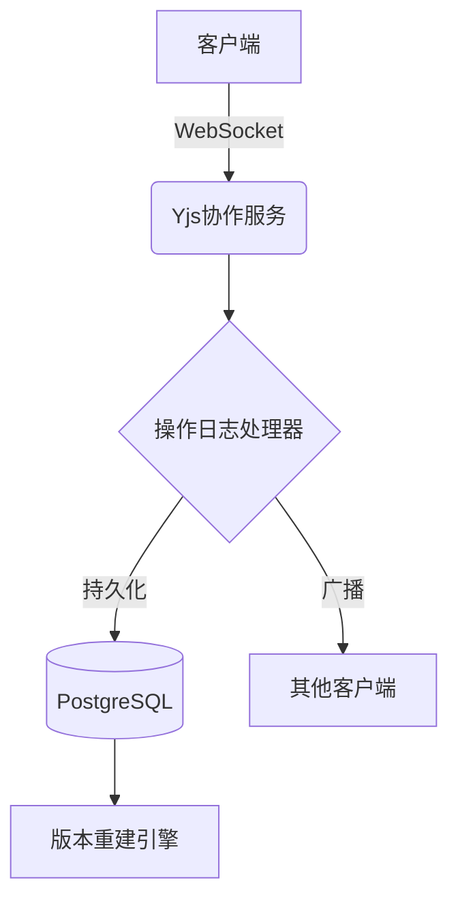

# Synote软件需求说明书

---

## 1. 引言

### 1.1 编写目的

本文档详细描述**Synote**多人协作富文本编辑器的功能需求、性能指标及系统设计，目标读者包括开发团队、项目管理者及维护人员。

### 1.2 背景

**Synote**是一款轻量级多人协作富文本编辑器，定位为类Notion的基础体验工具，支持文档管理、实时协作及团队协同。

- **核心设计**：所有文档（包括单人文档）均为实时协作文档，采用Yjs CRDT同步协议
- **任务提出者**：产品管理团队
- **开发者**：独立开发组
- **用户**：知识工作者、项目团队
- **运行环境**：Web端（Vue.js前端 + NestJS后端 + PostgreSQL + Yjs）

### 1.3 定义

| 术语 | 定义 |
| --- | --- |
| 富文本编辑 | 支持文本格式、多媒体嵌入、Markdown快捷输入的编辑能力 |
| 实时协作 | 多用户同步编辑同一文档，延迟低于300ms |
| 离线模式 | 网络中断时自动切换至本地保存，需用户手动触发同步 |
| Yjs | 用于实现实时数据同步的技术框架 |
| CRDT协议 | 无冲突复制数据类型，保障实时协作数据一致性 |
| 一人协作单元 | 单人编辑文档仍采用多人协作架构，支持秒级切换为多人协作 |

### 1.4 参考资料

- 《软件需求说明书规范》（GB/T 8567-2006）
- 《NestJS框架技术文档》
- Yjs官方文档
- Yjs CRDT技术白皮书

---

## 2. 任务概述

### 2.1 目标

开发支持多人实时协作的富文本编辑器，核心功能包括：

- 富文本编辑（格式控制、多媒体嵌入）
- 文档与工作区管理
- 权限分级协作（编辑者/查看者/所有者）
- 所有文档默认启用实时协作架构（单人文档即最小协作单元）
- 离线/在线混合保存机制

### 2.2 用户特点

| 用户类型 | 特点 |
| --- | --- |
| 普通用户 | 需直观界面，无需技术背景，高频次编辑文档 |
| 团队管理员 | 需权限管理、协作者邀请功能 |
| 移动端用户 | 依赖响应式布局，需离线编辑能力 |
| 跨设备用户 | 依赖实时同步能力，需保持多设备状态一致 |

### 2.3 假定和约束

- **技术栈**：Vue.js（前端）、NestJS（后端）、PostgreSQL（数据库）、Yjs（实时同步）
- **强制要求**：
    - 所有文档采用实时协作架构（单人文档即一人协作单元）
    - 禁止传统"本地草稿"模式
- **约束**：
    - 仅支持Web端，不开发原生移动应用
    - 离线模式下需用户手动同步
    - 不支持本地文件系统直连

---

## 3. 需求规定

### 3.1 功能需求

### 3.1.1 文档核心架构

| 功能 | 详细描述 |
| --- | --- |
| 实时协作基础 | 所有文档（包括新建空白文档）默认启用Yjs CRDT同步协议 |
| 存储模型 | 文档数据以操作日志（OpLog）形式存储，支持版本回溯和冲突解决 |
| 状态标识 | 文档角标显示实时状态：- 🌐在线同步中 - 📱仅我编辑（单人） - 👥多人协作中 |
| 动态协作切换 | 单人文档可秒级转为多人协作，新成员自动获取完整操作历史 |

### 3.1.2 富文本编辑

| 功能 | 详细描述 |
| --- | --- |
| 基础格式支持 | 文本加粗/斜体/颜色、标题（H1-H6）、列表、表格、分割线 |
| Markdown快捷输入 | `# 标题` → 大标题；`- [ ]` → 待办事项；`/`唤出插入菜单 |
| 多媒体嵌入 | 拖拽上传图片、粘贴截图（转Base64）、嵌入YouTube/B站视频链接 |
| 模板创建 | 提供“会议记录”“读书笔记”等预设模板 |
| 字数统计 | 实时显示文档字数/字符数 |
| 快捷键支持 | `Ctrl+B`（加粗）、`Ctrl+S`（同步触发）、`Ctrl+Z`（撤销） |

### 3.1.3 文档与工作区管理

| 功能 | 详细描述 |
| --- | --- |
| 多工作区 | 按主题创建独立工作区（如“学习”“工作”） |
| 文档收藏夹 | 星标标记常用文档，首页优先展示 |
| 最近访问记录 | 自动展示最近编辑的10个文档（按时间倒序） |
| 文档重命名 | 双击标题直接修改，实时同步 |
| 回收站 | 删除文档保留7天，支持恢复/彻底删除 |
| 全文搜索 | 按标题/内容关键词搜索，结果高亮展示 |

### 3.1.4 多人协作

| 功能 | 详细描述 |
| --- | --- |
| 实时协同编辑 | 多人同时编辑，内容实时同步（延迟<300ms） |
| 同步机制 | 在线模式：所有操作实时自动同步 离线模式：手动点击"同步"按钮上传缓存 |
| 协作者状态显示 | 用户头像旁显示在线（绿点）/离线状态 |
| 权限分级 | 所有者（管理权限）、编辑者（修改内容）、查看者（仅阅读） |
| @提及通知 | 输入`@`选择协作者，对方收到站内消息提醒 |
| 版本历史 | 每日自动保存快照+操作日志存储，支持文本级差异对比 |
| 邀请协作者 | 通过邮箱链接邀请，链接有效期24小时 |
| 冲突解决 | 离线编辑冲突时提供可视化对比界面，支持手动选择保留版本 |

### 3.1.5 样式与体验

| 功能 | 详细描述 |
| --- | --- |
| 主题切换 | 浅色/深色模式，支持夜间使用 |
| 自动保存提示 | 在线模式显示"已同步"状态图标；离线模式显示"待同步操作数" |
| 页面大纲导航 | 侧边栏展示H1-H6标题结构，点击快速跳转 |
| 响应式布局 | 桌面端：三栏布局（导航+编辑+属性）；移动端：编辑区全屏 |

### 3.1.6 导入导出

| 功能 | 详细描述 |
| --- | --- |
| 多格式粘贴 | 粘贴Word/网页内容时自动清除冗余样式 |
| 导出格式 | PDF（保留排版）、Markdown（纯文本） |

### 3.2 非功能性需求

| 类型 | 需求描述 |
| --- | --- |
| **性能** | - 文档加载时间≤2秒（万级文档） - 协同操作延迟<300ms |
| **实时性** | - 单人文档操作→云端延迟≤500ms - 冲突解决时间≤1s |
| **兼容性** | Chrome/Firefox/Safari/Edge最新版；iOS 14+/Android 10+ |
| **安全性** | - 账号密码加密存储（AES-256）- 操作日志传输加密（TLS 1.3） |
| **数据持久化** | - 断网时自动本地缓存（IndexedDB）- 恢复网络后手动触发同步 |
| **可靠性** | - 支持100+用户并发编辑- 操作日志丢失率<0.001% |
| **扩展性** | 单文档支持100+并发编辑者 |

### 3.3 用户场景流程示例

### 场景1：团队协作撰写报告（保留V1.1）

1. 用户A创建"项目总结报告"（工作模板）
2. 邀请成员B（编辑者）、C（查看者）
3. 用户A编写大纲 → `@B` 补充数据 → B实时编辑表格
4. 用户C查看进度（无法修改）
5. 导出PDF提交

### 场景2：单人文档转团队协作

1. 用户创建个人笔记（单人状态📱）
2. 点击"邀请协作"生成链接
3. 新成员加入后自动切换为多人状态👥
4. 所有协作者实时查看完整编辑历史

### 场景3：离线冲突解决

### 3.4 需求优先级

| 等级 | 功能集 | 包含子项 |
| --- | --- | --- |
| P0 | 实时协作基础 | CRDT协议、操作日志存储、状态标识 |
| P0 | 富文本编辑+文档管理 | 基础格式、模板、工作区、回收站、搜索 |
| P1 | 多人协作基础 | 实时协同、权限分级、@提及、同步机制 |
| P1 | 动态协作切换 | 秒级切换、权限继承 |
| P2 | 体验增强 | 深色模式、大纲导航、响应式布局 |
| P2 | 冲突解决机制 | 可视化冲突对比、多方案解决选项 |

---

## 4. 运行环境规定

### 4.1 架构设计

### 4.2 硬件要求

- **服务器**：
    - 基础配置：8GB RAM + 4核CPU（小型团队）
    - 扩展配置：16GB RAM/8核CPU（每节点支持500并发文档）
    - 存储：SSD磁盘阵列（IOPS≥10,000）
- **客户端**：支持现代浏览器的PC/移动设备

### 4.3 软件要求

| 组件 | 要求 | 关键功能 |
| --- | --- | --- |
| 操作系统 | Windows/Linux（服务器） |  |
| 浏览器 | Chrome 90+ / Firefox 85+ | 支持SharedArrayBuffer |
| 运行时 | Node.js 16.x |  |
| Yjs | 0.19.x | CRDT冲突解决算法 |
| PostgreSQL | 14+ | JSONB存储操作日志 |

### 4.4 接口设计

| 接口类型 | 协议 | 说明 |
| --- | --- | --- |
| 前端-后端 | RESTful API | 文档管理/用户认证 |
| 实时数据同步 | WebSocket | Yjs协作数据传输 |
| 第三方登录 | OAuth 2.0 | 支持Google/GitHub登录 |

---

## 5. 可维护性要求

- **模块化设计**：
    - 前端：Vue组件化（编辑器/工作区/协作状态组件）
    - 后端：NestJS模块化（认证/文档/协作模块）
- **日志可追溯**：
    - 操作日志包含设备ID、时间戳、用户ID
    - 提供文档历史重建API：`/history/{docId}?timestamp=2023-10-01T12:00:00`
- **文档化**：
    - 代码注释覆盖率≥80%
    - Swagger API文档 + 架构设计文档
- **监控体系**：
    - 实时协作状态仪表盘
    - 同步延迟>1s自动警报
- 实时/离线混合保存机制：
    - **在线模式**：所有修改通过Yjs实时同步至云端
    - **离线模式**：
        1. 检测网络中断自动切换本地存储（IndexedDB）
        2. 界面显示"离线编辑"状态及"待同步操作数"
        3. 用户需手动点击"同步"按钮触发上传
        4. 网络恢复后自动处理冲突

---

## 版本记录

- V1.0 | 2023-10-15 | 初稿
- V1.1 | 2023-10-20 | 新增离线保存需求（章节3.1.4）
- V2.0 | 2023-11-01 | 实现所有文档实时协作架构（章节3.1.1）